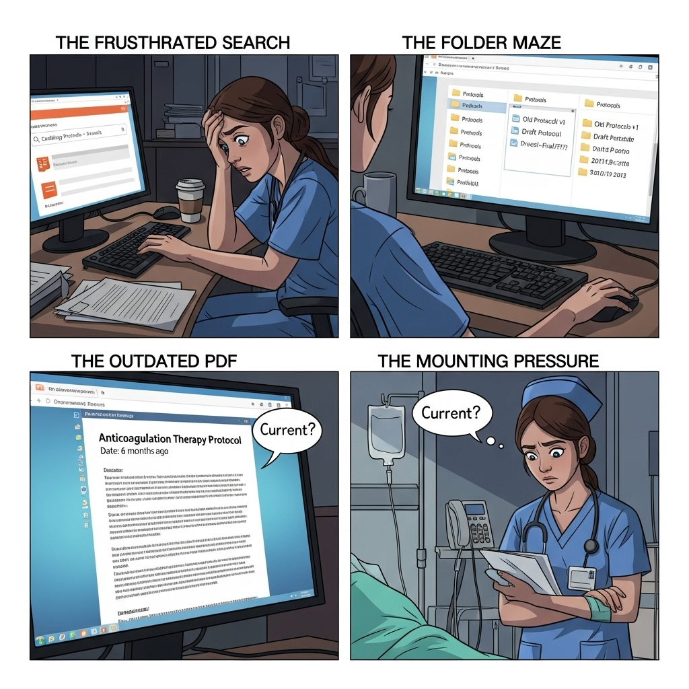

# MnM Hospital Multi-Agent Information Retrieval System

  

---

It's 3 AM in the cardiology ward. A newly rotated nurse needs to verify the hospital's protocol for administering high-dose anticoagulation therapy to a post-operative patient. The information exists somewhere. She checks the SharePoint site her supervisor mentioned during onboarding. Nothing under "Cardiology Protocols." She tries the shared drive. There are three folders labeled "Protocols," each containing dozens of PDFs. She searches her email for that message from last month. Was it the updated version or the draft?

Twenty minutes later, after checking three different locations and skimming through outdated policy documents, she finds what she believes is the current protocol: a PDF dated six months ago. But is it the latest version? She can't be certain. Meanwhile, her patient is waiting, and four other tasks demand her attention.

The process has not been done yet! Does she have actually the medicine that doctor prescribed? What is the precedure to check medication in the inventory of pharmacy? She knows that there was some information about checking medications in the onboarding document. Where is the onboarding document? Nerve-wrancking...

Of course, it is a hypothetical situation, yet similar scenarios repeat themselves thousands of times daily across hospitals worldwide. The problem isn't a lack of information. Modern hospitals are drowning in policies, procedures, protocols, and guidelines. The problem is **retrieval**: getting the right information to the right person at the right time, in a format they can act upon.

But here's what makes this particularly interesting: we're not talking about patient data retrieval. We're talking about institutional knowledge. The policies, standard operating procedures, clinical guidelines, HR regulations, and facility protocols that every staff member, from physicians to logistics coordinators, needs to do their job effectively. And unlike patient data, this information doesn't have the same GDPR or HIPAA constraints, making it a good candidate for AI-powered solutions.

In this project, we design a multi-agent information retrieval system to save hundreds of hours of healthcare workers. Let's dive in!!!

A sophisticated multi-agent system built with Google ADK (Application Development Kit) and Vertex AI Search that intelligently routes queries to specialized AI agents for hospital staff. The system includes a **Help/Onboarding Agent** (Priority 1) that guides new users on how to use the system before routing to domain experts.

## 🚀 Live Demo

**Application URL**: https://qwiklabs-gcp-04-488d2ba9611d.web.app

**API Endpoint**: https://hospital-agent-api-732642765257.us-central1.run.app

## 💡 Value Proposition

- **Intelligent Information Retrieval**: Get instant answers to domain-specific questions with AI-powered document search and grounding
- **Multi-Agent Orchestration**: Automatically routes queries to specialized agents (Nursing, HR, Pharmacy) for accurate, domain-specific responses
- **Multilingual Support**: Interact in English, Spanish, French, or German with automatic language detection
- **Real-Time Medication Tracking**: Check medication inventory, batch information, storage requirements, and controlled substance status
- **Contextual Conversations**: Maintains conversation history for follow-up questions and deeper exploration
- **Document-Grounded Responses**: All answers are backed by verified hospital documents with proper citations

## 🎯 Try These Sample Queries

### Nursing (English/Spanish)
- "How do I insert an IV line?"
- "What is the protocol for wound dressing?"
- "¿Cuál es el protocolo para administrar medicamentos?" (Spanish)

### HR (English/French)
- "How many vacation days do I have?"
- "What are the public holidays this year?"
- "Combien de jours de congé ai-je?" (French)

### Pharmacy (English/German)
- "Is ibuprofen 400mg in stock?"
- "Show me the inventory for acetaminophen"
- "Ist Paracetamol verfügbar?" (German)

### General Queries (Auto-routed)
- "What's the procedure for medication administration?"
- "When can I request time off?"
- "Do we have any antibiotics in stock?"

## 🏗️ System Components

The system consists of two main components:

### 1. 🔧 [Agent API](./agent-api/)
**Backend Multi-Agent System**

The core intelligence layer featuring:
- 🆘 Help/Onboarding Agent (Priority 1)
- 🏥 Nursing Agent (Medical procedures - EN/ES)
- 💼 HR Agent (Policies & benefits - EN/FR)
- 💊 Pharmacy Agent (Medication inventory - EN/DE)
- 🎯 Intelligent orchestrator with 2-tier priority routing
- 🔍 Vertex AI Search integration
- 📚 Document grounding with citations

**[📖 View Agent API Documentation →](./agent-api/README.md)**

---

### 2. 🖥️ [Agent UI](./agent-ui/)
**Frontend User Interface**

User-friendly interface for healthcare workers:
- 💬 Chat interface for queries
- 🎨 Role-based access (Nurse/Employee/Pharmacist)
- 🌐 Multilingual support
- 📱 Responsive design
- 🔄 Real-time responses

**[📖 View Agent UI Documentation →](./agent-ui/README.md)**

---

## 🚀 Quick Navigation

- **[Agent API Documentation](./agent-api/README.md)** - Backend system details, API reference, setup guide
- **[Agent UI Documentation](./agent-ui/README.md)** - Frontend application, usage guide, components
- **[API Usage Guide](./agent-api/API_USAGE.md)** - HTTP API endpoints and examples
- **[Help Agent Implementation](./agent-api/HELP_AGENT_IMPLEMENTATION.md)** - Complete guide for the onboarding agent
