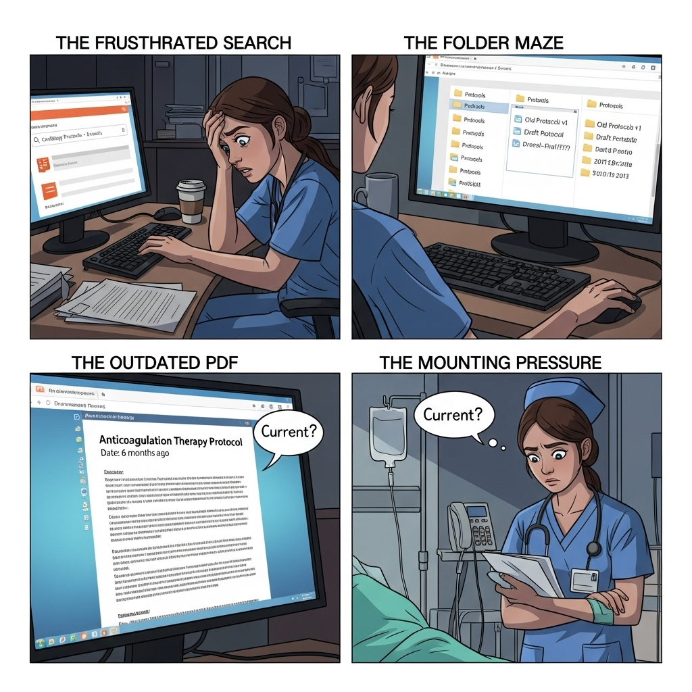

# MnM Hospital Multi-Agent Information Retrieval System

<p align="center">
  
</p>

---

It's 3 AM in the cardiology ward. A newly rotated nurse needs to verify the hospital's protocol for administering high-dose anticoagulation therapy to a post-operative patient. The information exists somewhere. She checks the SharePoint site her supervisor mentioned during onboarding. Nothing under "Cardiology Protocols." She tries the shared drive. There are three folders labeled "Protocols," each containing dozens of PDFs. She searches her email for that message from last month. Was it the updated version or the draft?

Twenty minutes later, after checking three different locations and skimming through outdated policy documents, she finds what she believes is the current protocol: a PDF dated six months ago. But is it the latest version? She can't be certain. Meanwhile, her patient is waiting, and four other tasks demand her attention.

The process has not been done yet! Does she have actually the medicine that doctor prescribed? What is the precedure to check medication in the inventory of pharmacy? She knows that there was some information about checking medications in the onboarding document. Where is the onboarding document? Nerve-wrancking...

Of course, it is a hypothetical situation, yet similar scenarios repeat themselves thousands of times daily across hospitals worldwide. The problem isn't a lack of information. Modern hospitals are drowning in policies, procedures, protocols, and guidelines. The problem is **retrieval**: getting the right information to the right person at the right time, in a format they can act upon.

But here's what makes this particularly interesting: we're not talking about patient data retrieval. We're talking about institutional knowledge. The policies, standard operating procedures, clinical guidelines, HR regulations, and facility protocols that every staff member, from physicians to logistics coordinators, needs to do their job effectively. And unlike patient data, this information doesn't have the same GDPR or HIPAA constraints, making it a good candidate for AI-powered solutions.

In this project, we design a multi-agent information retrieval system to save hundreds of hours of healthcare workers. Let's dive in!!!


A sophisticated multi-agent system built with Google ADK (Application Development Kit) and Vertex AI Search that intelligently routes queries to specialized AI agents for hospital staff. The system includes a **Help/Onboarding Agent** (Priority 1) that guides new users on how to use the system before routing to domain experts.

## Overview

This system serves three primary user types—**Nurses**, **HR Employees**, and **Pharmacists**—with multilingual support across **English**, **Spanish**, **French**, and **German**.

The orchestrator is the backbone of the entire system and uses **2-tier priority routing**: Priority 1 checks for "how to use" queries and routes to the Help Agent for guidance; since some of healthcare workers may not be familiar with AI Chat tools. Priority 2 routes domain questions to specialized agents (Nursing, HR, Pharmacy), each backed by Vertex AI Search for document grounding and accurate information retrieval.

**New users?** Simply ask "How do I use this system?" and the Help Agent will guide you with role-specific examples!

### Key Features

- 🆘 **Help/Onboarding Agent**: Priority 1 routing for "how to use" queries - guides users with examples
- ✨ **Multi-Agent Orchestration**: Intelligent routing to specialized domain agents
- 🌐 **Multilingual Support**: English, Spanish, French, German with automatic language detection
- 🔍 **Vertex AI Search Integration**: Document grounding with citations
- 📚 **Domain Expertise**: Specialized agents for Nursing, HR, and Pharmacy
- 🤖 **Google ADK Powered**: Built on Gemini 2.0 Flash
- 🎯 **Priority-Based Routing**: 2-tier routing (help first, then domain agents)

## Architecture

### Layer 1: Orchestrator
- **Priority 1 Routing**: Help/onboarding queries checked FIRST
- **Priority 2 Routing**: Domain-specific query classification
- Supports both explicit (role-based) and implicit (content-based) routing
- Intelligent detection of "how to use" vs "domain content" queries

### Layer 2: Specialized Agents

#### Priority 1 Agent (Checked First)
**Help/Onboarding Agent** (EN/ES/FR/DE)
- Guides users on how to use the system
- Provides role-specific example questions
- Detects "how to use" queries with 30+ patterns
- Never answers domain questions directly
- Routes: "How do I use this?" → Help Agent

#### Priority 2 Agents (Domain Experts)
1. **Nursing Agent** (English/Spanish)
   - Medical procedures and protocols
   - Patient care guidelines
   - Safety procedures
   - Routes: "How do I insert an IV?" → Nursing Agent

2. **HR Agent** (English/French)
   - Leave policies and benefits
   - Public holidays
   - Employee procedures
   - Routes: "How many vacation days?" → HR Agent

3. **Pharmacy Agent** (English/German)
   - Medication inventory
   - Drug information
   - Storage requirements
   - Routes: "Is ibuprofen in stock?" → Pharmacy Agent

### Layer 3: Vertex AI Search
- Three separate datastores (one per domain)
- Document retrieval and grounding
- Citation extraction

### Layer 4: Documents
- 3-5 documents per domain
- Multiple languages per document
- Markdown format for easy parsing

## Technology Stack

- **Google ADK** (Gemini 2.0 Flash)
- **Vertex AI Search** (Document retrieval)
- **Python 3.10+**
- **Google Cloud Platform**
- **Rich** (Terminal UI)

## Project Structure

```
hospital-multiagent-system/
├── README.md                   # This file
├── requirements.txt            # Python dependencies
├── config.py                   # Configuration management
├── .env.example               # Environment variables template
├── .gitignore                 # Git ignore rules
│
├── assets/                    # Images and media
│   └── hospital-problem-banner.png  # Banner image
│
├── agents/                    # Specialized agents
│   ├── __init__.py
│   ├── help_agent.py         # Help/Onboarding agent (Priority 1)
│   ├── nursing_agent.py      # Nursing domain agent
│   ├── hr_agent.py           # HR domain agent
│   ├── pharmacy_agent.py     # Pharmacy domain agent
│   └── prompts/              # Agent system instructions
│       ├── help_prompts.py
│       ├── nursing_prompts.py
│       ├── hr_prompts.py
│       └── pharmacy_prompts.py
│
├── orchestrator.py           # Main orchestrator
│
├── utils/                    # Utilities
│   ├── __init__.py
│   ├── vertex_search.py     # Vertex AI Search wrapper
│   └── query_classifier.py # Query classification
│
├── docs/                     # Sample documents
│   ├── nursing/             # Nursing protocols (EN/ES)
│   ├── hr/                  # HR policies (EN/FR)
│   └── pharmacy/            # Pharmacy inventory (EN/DE)
│
├── tests/                    # Test suite
│   ├── __init__.py
│   └── test_help_agent.py   # Help agent tests (7/7 passing)
│
├── demo.py                   # Demo script
├── demo_help_agent.py        # Help agent demo script
├── HELP_AGENT_IMPLEMENTATION.md  # Help agent documentation
│
└── outputs/                  # Demo results output
    └── .gitkeep
```

## Prerequisites

### Google Cloud Setup

1. **Google Cloud Project** with billing enabled
2. **Vertex AI API** enabled
3. **Vertex AI Search** enabled
4. **Service Account** with appropriate permissions:
   - Vertex AI User
   - Discovery Engine Editor

### Local Requirements

- Python 3.10 or higher
- pip (Python package manager)
- Git

## Installation

### 1. Clone the Repository

```bash
git clone <repository-url>
cd hospital-multiagent-system
```

### 2. Create Virtual Environment

```bash
python -m venv venv
source venv/bin/activate  # On Windows: venv\Scripts\activate
```

### 3. Install Dependencies

```bash
pip install -r requirements.txt
```

### 4. Configure Environment

Copy the example environment file and fill in your GCP details:

```bash
cp .env.example .env
```

Edit `.env` with your credentials:

```env
# Google Cloud Configuration
GCP_PROJECT_ID=your-project-id
GCP_LOCATION=us-central1

# Vertex AI Search Datastore IDs
NURSING_DATASTORE_ID=your-nursing-datastore-id
HR_DATASTORE_ID=your-hr-datastore-id
PHARMACY_DATASTORE_ID=your-pharmacy-datastore-id

# Model Configuration
MODEL_NAME=gemini-2.0-flash-exp
TEMPERATURE=0.2

# Search Configuration
DYNAMIC_THRESHOLD=0.3
MAX_RESULTS=5

# System Settings
LOG_LEVEL=INFO
TIMEOUT=30
ENVIRONMENT=development
```

### 5. Set Up Vertex AI Search Datastores

For each domain (Nursing, HR, Pharmacy):

1. Go to [Google Cloud Console](https://console.cloud.google.com/)
2. Navigate to **Vertex AI Search**
3. Create a new **Search App**
4. Create a **Datastore** for unstructured documents
5. Upload the documents from `docs/nursing/`, `docs/hr/`, or `docs/pharmacy/`
6. Copy the **Datastore ID** to your `.env` file

### 6. Authenticate with Google Cloud

```bash
gcloud auth application-default login
```

## Usage

### Option 1: HTTP API (Recommended)

Start the HTTP API server for easy integration:

```bash
export GOOGLE_APPLICATION_CREDENTIALS=./sakey.json
python3 api.py
```

The API will start at `http://localhost:8000`

- **Interactive Docs**: http://localhost:8000/docs
- **API Documentation**: See [API_USAGE.md](API_USAGE.md)

#### Quick API Examples

```bash
# Health check
curl http://localhost:8000/health

# Query the system
curl -X POST http://localhost:8000/query \
  -H "Content-Type: application/json" \
  -d '{"query": "What about blood glucose monitoring?", "user_role": "nurse"}'

# Get agent information
curl http://localhost:8000/agents
```

See [API_USAGE.md](API_USAGE.md) for complete API documentation, examples, and client code.

### Option 2: Running the Demo

The demo script showcases the system with 12 test scenarios across all languages:

```bash
python demo.py
```

This will:
- Initialize the orchestrator and all agents
- Run health checks
- Execute demo scenarios covering:
  - Nursing queries (EN/ES)
  - HR queries (EN/FR)
  - Pharmacy queries (EN/DE)
  - Intelligent auto-routing
- Save results to `outputs/demo_results_*.json`
- Optionally enter interactive mode

### Interactive Mode

After the demo, you can enter interactive mode to ask custom questions:

```python
python demo.py
# After demo completes, select 'y' for interactive mode
```

### Using the Orchestrator Programmatically

```python
from orchestrator import HospitalOrchestrator

# Initialize orchestrator
orchestrator = HospitalOrchestrator()

# Help query - automatically routes to Help Agent (Priority 1)
result = orchestrator.process_query(
    query="How do I use this system as a nurse?"
)
print(result['answer'])  # Provides guidance with example questions
print(f"Priority: {result['routing_info']['priority']}")  # Output: 1

# Domain query - routes to Nursing Agent (Priority 2)
result = orchestrator.process_query(
    query="How do I insert an IV line?",
    user_role="nurse"
)
print(result['answer'])  # Provides actual protocol information
print(f"Priority: {result['routing_info']['priority']}")  # Output: 2

# Process a query with intelligent routing
result = orchestrator.process_query(
    query="How many vacation days do I have?"
)

# Access the response
print(result['answer'])
print(f"Routed to: {result['agent']}")
print(f"Language: {result['language']}")
```

### Using Individual Agents

```python
from agents.help_agent import HelpAgent
from agents.nursing_agent import NursingAgent
from agents.hr_agent import HRAgent
from agents.pharmacy_agent import PharmacyAgent

# Use Help Agent for onboarding
help_agent = HelpAgent(project_id="your-project-id")
result = help_agent.provide_guidance("How do I use this as a nurse?")
print(result['answer'])  # Shows nursing-specific examples

# Check if a query is a help query
is_help = HelpAgent.is_help_query("Can I check inventory here?")
print(f"Is help query: {is_help}")  # True

# Use domain agents for actual questions
nursing = NursingAgent(project_id="your-project-id")
result = nursing.search_protocols("How do I insert an IV?")
print(result['answer'])

# Check citations
if result['grounding_metadata']:
    for citation in result['grounding_metadata']:
        print(f"Source: {citation.get('title', 'N/A')}")
```

## API Reference

### HospitalOrchestrator

Main orchestrator class for routing queries.

#### Methods

- `process_query(query, user_role=None, agent_override=None)` - Process a user query
- `multi_agent_query(query, agents=None)` - Query multiple agents simultaneously
- `health_check()` - Check system health
- `get_agent_info()` - Get information about available agents

### Individual Agents

All agents provide domain-specific methods:

#### HelpAgent (Priority 1)

- `provide_guidance(query, temperature=0.3)` - Provide system usage guidance
- `is_help_query(query)` - Static method to detect help queries (used by orchestrator)
- `detect_language(text)` - Detect query language (EN/ES/FR/DE)
- `detect_user_role(query)` - Detect user role from query context

**Note:** Help Agent does NOT answer domain questions. It guides users with examples.

#### NursingAgent

- `search_protocols(query, temperature=0.2)` - Search nursing protocols
- `get_procedure_steps(procedure_name, language="en")` - Get procedure steps
- `check_safety_protocol(topic, language="en")` - Check safety protocols
- `get_equipment_list(procedure_name, language="en")` - Get equipment lists

#### HRAgent

- `search_policies(query, temperature=0.2)` - Search HR policies
- `get_leave_policy(leave_type="annual", language="en")` - Get leave policies
- `get_public_holidays(year=2025, language="en")` - Get holiday information
- `calculate_vacation_days(years_of_service, is_full_time, fte, language="en")` - Calculate vacation days

#### PharmacyAgent

- `search_inventory(query, temperature=0.2)` - Search medication inventory
- `check_medication_availability(medication_name, strength, language="en")` - Check stock
- `get_medication_info(medication_name, language="en")` - Get drug information
- `check_controlled_substances(medication_name, language="en")` - Check controlled substances

## Configuration

### Environment Variables

Key configuration options in `.env`:

| Variable | Description | Default |
|----------|-------------|---------|
| `GCP_PROJECT_ID` | Google Cloud Project ID | Required |
| `NURSING_DATASTORE_ID` | Nursing documents datastore | Required |
| `HR_DATASTORE_ID` | HR documents datastore | Required |
| `PHARMACY_DATASTORE_ID` | Pharmacy documents datastore | Required |
| `MODEL_NAME` | Gemini model to use | `gemini-2.0-flash-exp` |
| `TEMPERATURE` | Model temperature | `0.2` |
| `DYNAMIC_THRESHOLD` | Search threshold | `0.3` |
| `LOG_LEVEL` | Logging level | `INFO` |

### Routing Configuration

The orchestrator uses two routing methods:

1. **Keyword-based** (fast): Pattern matching on query text
2. **Gemini-based** (accurate): AI classification of query intent

Configuration in `utils/query_classifier.py`.

## Example Queries

### Help/Onboarding (All Languages)

**Priority 1 queries - checked FIRST before routing to domain agents:**

```
EN: "How do I use this system as a nurse?"
ES: "¿Cómo puedo usar este sistema?"
FR: "Comment utiliser ce système?"
DE: "Wie benutze ich dieses System?"

EN: "What questions can I ask?"
EN: "Can I check pharmacy inventory here?"
EN: "What is this tool for?"
```

**Response:** Provides guidance with 3-5 role-specific example questions

---

### Nursing (English/Spanish)

```
EN: "How do I insert an IV line?"
ES: "¿Cómo inserto una vía intravenosa?"

EN: "What is the wound care protocol?"
ES: "¿Cuál es el protocolo de curación de heridas?"

EN: "What equipment do I need for wound dressing?"
ES: "¿Qué equipo necesito para curar heridas?"
```

### HR (English/French)

```
EN: "How many vacation days do I have?"
FR: "Combien de jours de vacances ai-je?"

EN: "What are the public holidays for 2025?"
FR: "Quels sont les jours fériés pour 2025?"

EN: "How do I request time off?"
FR: "Comment demander un congé?"
```

### Pharmacy (English/German)

```
EN: "Is ibuprofen 400mg in stock?"
DE: "Ist Ibuprofen 400mg auf Lager?"

EN: "Which antibiotics are available?"
DE: "Welche Antibiotika sind verfügbar?"

EN: "Do we have insulin in the pharmacy?"
DE: "Haben wir Insulin in der Apotheke?"
```

## Performance

Expected performance metrics:

- **Response Time**: < 5 seconds per query
- **Routing Accuracy**: > 90%
- **Language Detection**: > 95%
- **Document Grounding**: Citations included when relevant

## Troubleshooting

### Common Issues

**Issue**: `Configuration validation failed: Missing required environment variables`

**Solution**: Ensure all required variables in `.env` are set correctly

---

**Issue**: `Failed to initialize Vertex Search client`

**Solution**:
1. Verify GCP authentication: `gcloud auth application-default login`
2. Check that Vertex AI API is enabled
3. Verify service account has correct permissions

---

**Issue**: No grounding metadata returned

**Solution**:
1. Verify documents are uploaded to Vertex AI Search datastores
2. Check datastore IDs in `.env` are correct
3. Ensure documents contain relevant information for queries

---

**Issue**: Wrong agent routing

**Solution**:
1. Check query keywords match expected patterns
2. Review `utils/query_classifier.py` keyword lists
3. Use `user_role` parameter for explicit routing

## Development

### Adding New Documents

1. Create markdown file in appropriate `docs/` subdirectory
2. Upload to corresponding Vertex AI Search datastore
3. Test queries against new documents

### Extending Agents

To add new functionality to an agent:

1. Add method to agent class (e.g., `agents/nursing_agent.py`)
2. Update prompts if needed (`agents/prompts/nursing_prompts.py`)
3. Add test scenarios to `demo.py`

### Adding New Languages

1. Add language detection keywords to `utils/vertex_search.py:detect_language()`
2. Add language-specific instructions to agent prompts
3. Create translated documents in `docs/`
4. Update demo scenarios with new language examples

## Testing

### Help Agent Tests

The Help Agent includes comprehensive test coverage:

```bash
# Install test dependencies
pip install pytest pytest-asyncio pytest-cov

# Run help agent tests
pytest tests/test_help_agent.py -v

# Run manual test scenarios
python3 tests/test_help_agent.py

# Run help agent demo
python3 demo_help_agent.py
```

**Test Coverage:**
- ✅ Help query detection (7/7 passing)
- ✅ Multilingual support (EN/ES/FR/DE)
- ✅ Domain query exclusion
- ✅ Language detection
- ✅ Role detection
- ✅ Integration with orchestrator

**Test Results:** All 7 core detection tests passing

### Additional Tests

To add more comprehensive tests for other agents:

```bash
# Run all tests (to be expanded)
pytest tests/ -v
```

## License

MIT License - See LICENSE file for details

## Contributing

Contributions are welcome! Please:

1. Fork the repository
2. Create a feature branch
3. Make your changes
4. Add tests
5. Submit a pull request

## Acknowledgments

- Built with [Google ADK](https://ai.google.dev/)
- Powered by [Vertex AI Search](https://cloud.google.com/generative-ai-app-builder/docs)
- Uses [Gemini 2.0 Flash](https://deepmind.google/technologies/gemini/)

## Support

For issues and questions:
- Open an issue on GitHub
- Review the troubleshooting section
- Check Google ADK documentation

## Roadmap

Completed features:

- [x] **HTTP REST API** with FastAPI
- [x] **RAG Pipeline** with Vertex AI Search + Gemini
- [x] **Interactive API Documentation** (Swagger/ReDoc)
- [x] **Help/Onboarding Agent** with Priority 1 routing (NEW!)
- [x] **Test Suite** for Help Agent (7/7 passing)
- [x] **Multilingual Detection** (EN/ES/FR/DE)

Future enhancements:

- [ ] Comprehensive test suite for all agents with pytest
- [ ] Streamlit web UI
- [ ] Additional languages (Italian, Portuguese)
- [ ] Multi-agent consultation mode
- [ ] Real-time inventory integration
- [ ] User authentication and personalization
- [ ] Analytics dashboard
- [ ] PDF document support
- [ ] Voice input support

---

**Built for the hackathon** | **January 2025** | **Powered by Google ADK**
